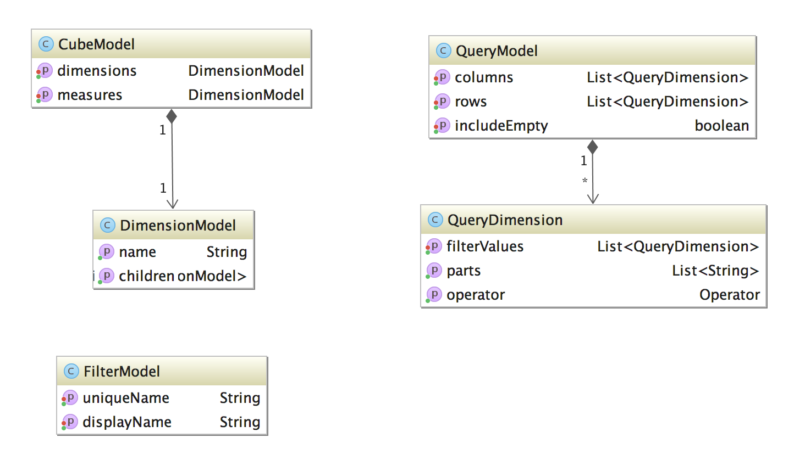
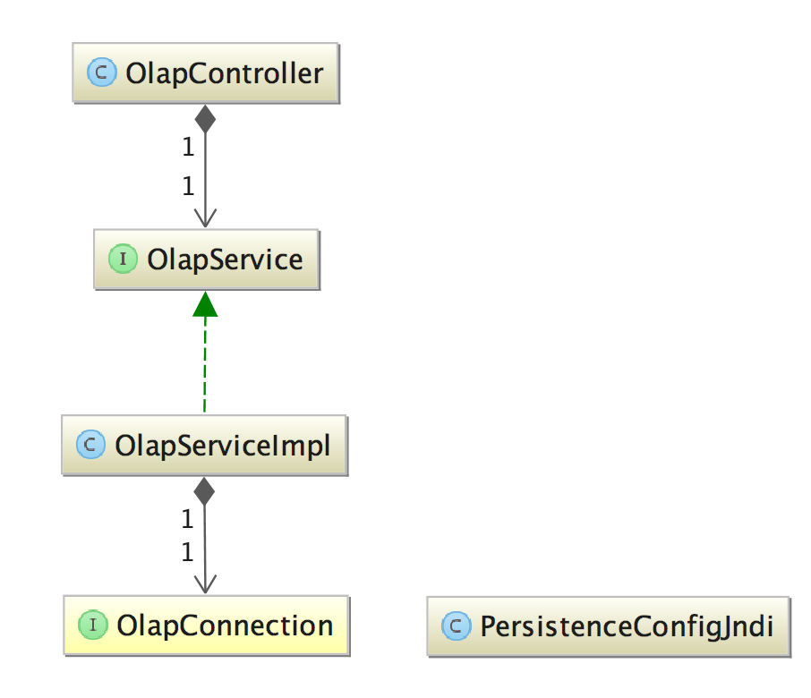

# bi-demo
PoC från projektets utvärdering av BI-lösningar okt/nov 2016.

## Beskrivning
Vi har tagit fram två separata OLAP-kuber baserat på data från:

- Intygsdata (från intygstjänsten) - identifieras 'bi' nedan.
- Sjukfallsdata (från statistiktjänsten) - identifieras 'st' nedan.

Normalfallet i den incheckade konfigurationen är att köra på 'st'-varianten.

## Konfigurera lokal MySQL
1. Installera MySQL om du inte redan har gjort det.
2. Logga in som DBA/root och kör följande script (för st):

    CREATE USER 'st'@'localhost' IDENTIFIED BY 'st';
    GRANT ALL PRIVILEGES ON * . * TO 'st'@'localhost';
    CREATE DATABASE 'st' /*!40100 DEFAULT CHARACTER SET utf8 */;
    
(Eller kör /persistence/src/main/resources/create-st-user.xml)
    
Tabeller, index, data etc. kommer skapas av Liquibase vid första uppstart.

## bi-persistence

Detta delprojekt nyttjar Liquibase för att skapa scheman (st eller bi) och populera dessa med data.

Notera att 'bi'-data inte finns incheckat då dessa har scramblade personnummer.

#### BI
Följande tabeller:
- fact_intyg
- dim_intygstyp
- dim_vardenhet
- dim_vardgivare
- dim_icd
- dim_date

#### ST
Följande tabeller:
- fact_sjukfall
- dim_date
- dim_dx_kapitel
- dim_dx_avsnitt 
- dim_dx_kategori
- dim_dx_kod
- dim_sjukskrivningsgrad
- dim_age
- dim_gender
- dim_lan
- dim_enheter
- dim_sjukfalllakare

## bi-web
Klassisk 'web'-modul för att tillhandahålla tjänstelagret.

- REST-gränssnitt för att läsa ut OLAP-kubens measures och dimensions, ställa frågor osv.
- Spring-baserad mekanism för att starta Mondrian lokalt mot databasschemat från bi-persistence samt metadatafilen i /src/main/webapp/WEB-INF/stat.xml
- Konfigurationsklasser

#### Metadatafiler
Det finns en OLAP-schemafil för respektive databasmodell, 'stat.xml' och 'intyg.xml'.

#### Datasources
För respektive datakälla behöver vi för Mondrians skull knyta ihop relationsdatabas med OLAP-schema. Detta sker i XML-filerna:
- st-datasources.xml
- bi-datasources.xml

Dessa ligger idag i WEB-INF.

TODO Dessa filer innehåller idag absoluta sökvägar, fixa det! Tyvärr verkar det bara funka att lägga stat.xml i roten av projektet...

#### Konfiguration

Man styr huruvida man vill köra med 'bi'-modellen eller 'st'-modellen genom att aktivera spring-profilen 'stat' i /web/build.gradle.

    gretty {
        httpPort = 8020
        contextConfigFile = "${projectDir}/src/main/resources/jetty-web.xml"
        contextPath = '/'
        logbackConfigFile = "${projectDir}/src/main/resources/logback.xml"
        jvmArgs = [
            '-Dspring.profiles.active=test,stat',    // <---- HÄR!
            '-Dbi.config.file=' + projectDir + '/src/main/resources/st.properties',
            '-Dcredentials.file=' + projectDir + '/src/main/resources/dev-credentials.properties',
            '-Dbi.resources.folder=/' +projectDir + '/../src/main/resources',
            '-XX:MaxPermSize=256M',
            '-agentlib:jdwp=transport=dt_socket,server=y,suspend=n,address=8018'
        ]

### Enhetstest / Integrationstest
Det finns några integrationstester skrivna som verifierar att XML-metadata matchar underliggande relationsdatabas. Dessa är tills vidare avstängda mha @Ignore på testnivå då respektive testsvit kräver att databasen är korrekt uppsatt lokalt.

Testerna skall fungera om man sätter upp respektive databasschema (st, bi) korrekt. Det bör fixas att med H2 skapa databasschema vid integrationstest om/när någon tar denna PoC vidare.

### tools
- .groovy-script för att för 'bi'-schema transformera data från tabellen intyg.SJUKFALL_CERT till INSERT-statements för bi.fact_intyg

#### Användning
Kör först scriptet mot din lokala MySQL (som behöver ha någon form av data i intyg.SJUKFALL_CERT):

    gradle run
    
Det tar en stund, default är 500 000 poster.

Importera sedan i din MySQL-databas:

    mysql -u bi -p bi < factdata.txt
    
OBS! factdata-filen är gitignorad, skall ej pushas av hängslen-och-livrem skäl. Även om det inte är riktiga personnummer i filen som skapas så är de syntaktiskt korrekta och kan i framtiden komma att användas för verkliga personer.

## Databasstruktur och Mondrian-schema

### Stat
För stat har vi ett "star schema" enligt gängse norm med "fact_sjukfall" i mitten där olika dimensioner pekas ut medelst främmandenycklar till diverse dim_-tabeller.

Mondrianschemat (stat.xml) har några lite mer avancerade lösningar med "levels" och "hierarkier" där man strukturellt skapar en hierarki av dimensionsattribut. Typexemplet är diagnoskoderna som kan illustreras enligt följande:

    [fact_sjukfall] -> [dim_dx_kod] -> [dim_dx_kategori] -> [dim_dx_avsnitt] -> [dim_dx_kapitel]
    
Denna hierarki skall man deklarera som <Link>-element under <PhysicalSchema>

     <Link target="dim_dx_avsnitt" source="dim_dx_kapitel">
      <ForeignKey>
        <Column name="kapitel"/>
      </ForeignKey>
    </Link>
    <Link target="dim_dx_kategori" source="dim_dx_avsnitt">
      <ForeignKey>
        <Column name="avsnitt"/>
      </ForeignKey>
    </Link>
    <Link target="dim_dx_kod" source="dim_dx_kategori">
      <ForeignKey>
        <Column name="kategori"/>
      </ForeignKey>
    </Link>
    
Ovanstående säger att "dim_dx_avsnitt" har främmandenyckeln "kapitel" som pekar på primärnyckeln i tabellen "dim_dx_kapitel". Osv.    
    
Även Datum-dimensionen är lite speciell där 'fact_sjukfall's olika datum pekar med en int på en rad i dim_date.

dim_date i sin tur har egna kolumner för year och month som då kan ordnas hierarkiskt genom följande XML där en sammansatt nyckel av year och month knyter samman år/månad:

    <Dimension name="Datum" table='dim_date' type='TIME' key="ID">
        <Attributes>
          <Attribute name='ID' keyColumn='id' hasHierarchy='false'/>
          <Attribute name='År' keyColumn='year' levelType='TimeYears' hasHierarchy='false'/>
    
          <Attribute name='Månad' levelType='TimeMonths' hasHierarchy='false'>
            <Key>
              <Column name='year'/>
              <Column name='month'/>
            </Key>
            <Name>
              <Column name='month'/>
            </Name>
          </Attribute>
        </Attributes>
    
        <Hierarchies>
          <Hierarchy name='Datum' hasAll='true'>
            <Level attribute='År'/>
            <Level attribute='Månad'/>
          </Hierarchy>
        </Hierarchies>
      </Dimension>

I <Hierarchies>-elementet strukturerar vi sedan de två attributen i en tydlig hierarki där månad är underordnat år mha <Level> attributen.

### Vår representation av Kub och Query

#### Kub
GUI:t använder en REST-endpoint för att få ut kubens olika measures och dimensioner. Dessa levereras i form av en JSON-serialiserad instans av en CubeModel.

En typisk del av en CubeModel kan se ut så här:

    {
      "measures": {
        "name": "Measures",
        "children": [
          {
            "name": "Antal sjukfall",
            "children": []
          },
          {
            "name": "Genomsnittl sjukskrivningslangd",
            "children": []
          }
        ]
      },
      "dimensions": {
        "name": "Dimensions",
        "children": [
          {
            "name": "Ålder",
            "children": [
              {
                "name": "År",
                "children": [
                  {
                    "name": "(All)",
                    "children": []
                  },
                  {
                    "name": "År",
                    "children": []
                  }
                ]
              }
            ]
          },
 
Dvs varje dimension kan innehålla (n) nivåer. Det är troligt att det är en mer lättläst lösning att skicka ut en "platt" lista med en komplett hierarki, något i stil med:

- dimension.Ålder.År.År
- dimension.Ålder.År.(All)
- dimension.Datum.Datum.(All)
- dimension.Datum.Datum.År
- dimension.Datum.Datum.Månad

Det skulle dock kräva att GUI:t själv benar ut hierarkin om man vill ha en trädliknande rendering av dimensionerna.

#### Query
När GUI:t skickar in frågor så nyttjar vi en egendefinierad QueryModel som innehåller listor ordnade rader och kolumner för de dimensioner som skall ligga till grund för frågan. Den kan se ut så här:

    {
      "rows": [
        {
          "operator": "CHILDREN",
          "parts": [
            "Datum",
            "Datum",
            "År"
          ],
          "filterValues": []
        }
      ],
      "columns": [
        {
          "operator": "CHILDREN",
          "parts": [
            "Measures",
            "Antal sjukfall"
          ],
          "filterValues": []
        },
        {
          "operator": "CHILDREN",
          "parts": [
            "Kön",
            "Kön",
            "Kön"
          ],
          "filterValues": []
        }
      ],
      "includeEmpty": true
    }

Ovanstående exempel innehåller en rad (Datum.Datum.År) och två kolumner (Measures.Antal sjukfall) och (Kön.Kön.Kön). Vi har här valt att skicka in respektive dimension som en array av "parts" vilket kanske kan ersättas med en enklare path-notation som man sedan på serversidan kan hantera snyggare.
_includeEmpty_ styr om MDX-frågan som genereras av Olap4J skall lägga på NonEmpty på samtliga dimensioner så man inte får tillbaka rader eller kolumner utan värden.

#### Service-arkitektur
BI-demo använder sig av en ytterst enkel lagermodell med controller-lager (REST) samt ett tjänstelager som bootstrappar Mondrian och kommunicerar mot denna via OlapConnection.

#### Mappning mellan våra modeller och Olap4j

Det absolut krångligaste med denna PoC är hur vi konverterar mellan Olap4j's syn på vad en Dimension / fråga / kub är och vår förenklade modell.

Olap4j representerar Kuber och dimensioner i form av interface som Mondrian sedan tillhandahåller representationer av. Det är lite för komplext att beskriva i löpande text, men övergripande kan det beskrivas så här:

    Dimension -> Hierarkier -> Levels -> Members
    
    Datum.Datum.Ar
    Datum.Datum.Manad
    Datum.Datum.2014
    Datum.Datum.2016.08
    
_Measures_ får en del specialhantering då dessa är strukturellt annorlunda jämfört med vanliga dimensioner. Det ger att vi mappar våra "Measures"-dimensioner i QueryModel till org.olap4j.metadata.Member.

_Dimensioner_ (som ej är measures) har en mer komplex mappningsprocess där vi nästlat itererar över en dimensions hierarkier -> members och försöker matcha ev. filtervärden vi skickat in. Saknar vi filtervärde för aktuell axel så är det istället på Level-nivå vi försöker matcha våra "paths".

### MDX
MDX är frågespråket man använder mot Mondrian ifall man _inte_ använder den programmatiska frågemodell via Olap4J som vi använder. Dvs, vi nyttjar inte MDX aktivt. Vi loggar dock den faktiska MDX som Olap4J spottar ur sig vilket kan vara väldigt nyttigt i debyg-syfte:

    SELECT
    NON EMPTY CrossJoin({[Measures].[Antal sjukfall]}, [Kön].[Kön].[Kön].Members) ON COLUMNS,
    NON EMPTY {[Datum].[Datum].[2015].[08]} ON ROWS
    FROM [Stat]
    
Ovanstående query kommer returnera ett CellSet med två kolumner (Antal sjukfall per kön) för Datum som filtrerats ned på augusti 2015.

    |           | Antal sjukfall                  |
    |           | FEMALE         | MALE           |
    +------+----+----------------+----------------+
    | 2015 | 08 |            234 |            177 |

Renderingen av CellSet till tabell sker helt genom Olap4J-klassen _org.olap4j.layout.RectangularCellSetFormatter_. Om/när vi realiserar denna PoC så får vi givetvis skapa vår egen renderingsmotor för HTML-tabeller i någon form.